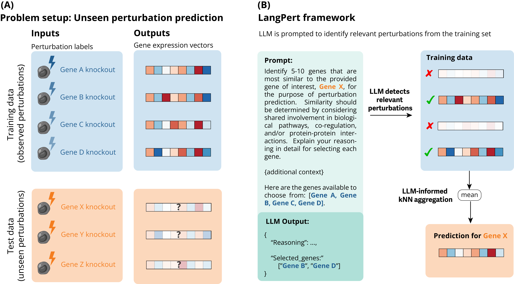

# LangPert

A modular LLM framework for cell perturbation predictions using a novel hybrid LLM-kNN approach.



## Overview

LangPert combines Large Language Models (LLMs) with k-nearest neighbors to predict cellular perturbation effects. The LLM identifies relevant genes from the training set based on its prior knowledge and biological reasoning, and the target gene's prediction is formed by averaging the identified kNN gene set.

This implementation provides flexible backends and prompts so that users can easily experiment with different models and biological contexts. For details on the method, see our [paper](https://openreview.net/forum?id=Tmx4o3Jg55). 

**Supported backends:**

- **API backends**: OpenAI, Google Gemini
- **Local backends**: HuggingFace Transformers, Unsloth-optimized models


## Installation

**Basic installation** (includes OpenAI and Gemini API support):
```bash
uv pip install -e .
```

**With local model support** (Transformers + Unsloth):
```bash
uv pip install -e .[all]
```

## Available Backends

LangPert supports multiple LLM backends for flexibility:

- `gemini_backend` - Google Gemini API (gemini-2.5-pro, gemini-2.5-flash etc)
- `openai_backend` - OpenAI and compatible APIs (gpt-4o, o4-mini etc)
- `transformers_backend` - HuggingFace Transformers (local inference)
- `unsloth_backend` - Unsloth-optimized models (faster local inference)

## Quick Start

In this first example, we'll use Google Gemini API (you can get a key from Google AI Studio), but you can use any backend listed above.


```python
import os
import numpy as np
import langpert

from langpert import LangPert

# Your observed perturbation data
observed_effects = {
    "TP53": np.random.randn(100),
    "BRCA1": np.random.randn(100),
    "BRCA2": np.random.randn(100),
    "ATM": np.random.randn(100),
    "MDM2": np.random.randn(100),
    "CDKN1A": np.random.randn(100),
    "RPL7": np.random.randn(100),
    "RPS6": np.random.randn(100),
}

# Create a model with Gemini backend
from langpert.backends import gemini_backend

backend = gemini_backend(
    api_key=os.getenv("GOOGLE_API_KEY"),
    model="gemini-2.5-flash",
    temperature=0.2
)

model = LangPert(
    backend=backend,
    observed_effects=observed_effects,
    prompt_template="default"
)

# Single prediction
result = model.predict_perturbation("MYC")

print(f"Inferred gene set: {result.knn_genes}")
print(f"Prediction shape: {result.prediction.shape}")
print(f"LLM reasoning: {result.reasoning[:200]}...")

```

### Using Local Models

For running models locally with HuggingFace Transformers:

```python
from langpert.backends import transformers_backend

backend = transformers_backend(
    model_name="Qwen/Qwen3-32B",
    load_in_4bit=True, 
    device="cuda"
)

model = LangPert(backend=backend, observed_effects=observed_effects)
result = model.predict_perturbation("MYC")
```

Or with Unsloth for optimized inference:

```python
from langpert.backends import unsloth_backend

backend = unsloth_backend(
    model_name="unsloth/Qwen3-14B-unsloth-bnb-4bit",
    load_in_4bit=True
)
```


## Repository Structure

```
langpert/
├── backends/          # LLM backend implementations
│   ├── openai.py     # OpenAI/Azure compatible APIs
│   ├── gemini.py     # Google Gemini API
│   ├── transformers.py  # HuggingFace Transformers
│   └── unsloth.py    # Unsloth-optimized models
├── prompts/          # Prompt templates and loading utilities
│   ├── templates.py  # Prompt template registry
│   ├── system_prompts.py  # System prompt templates
│   └── loader.py     # Template loading functions
├── core/             # Main LangPert model
│   └── model.py      # LangPert class with prediction logic
├── utils.py          # Helper functions (gene extraction, kNN)
└── cache_utils.py    # Cache management for local models
```


## Citation

If you use LangPert in your research, please cite:

```
@inproceedings{martens2025langpert,
  title={LangPert: LLM-Driven Contextual Synthesis for Unseen Perturbation Prediction},
  author={M{\"a}rtens, Kaspar and Martell, Marc Boubnovski and Prada-Medina, Cesar A and Donovan-Maiye, Rory},
  booktitle={ICLR 2025 Workshop on Machine Learning for Genomics Explorations}
}
```
