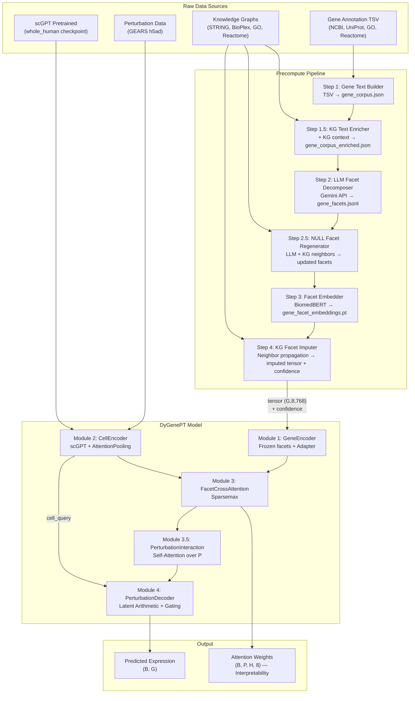
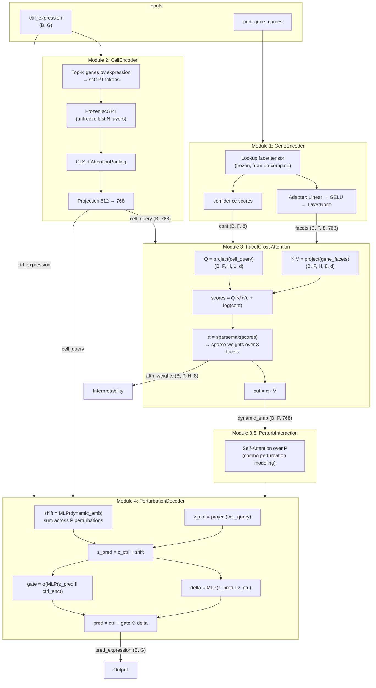
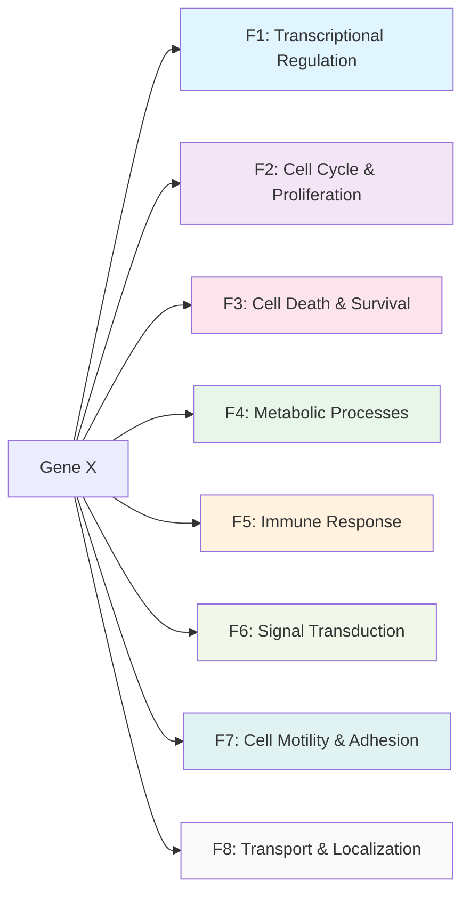
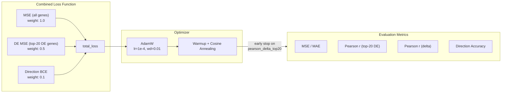
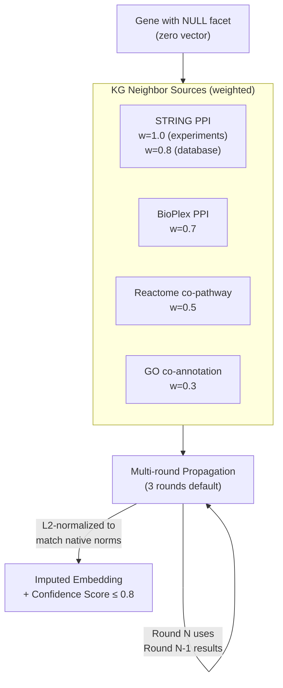
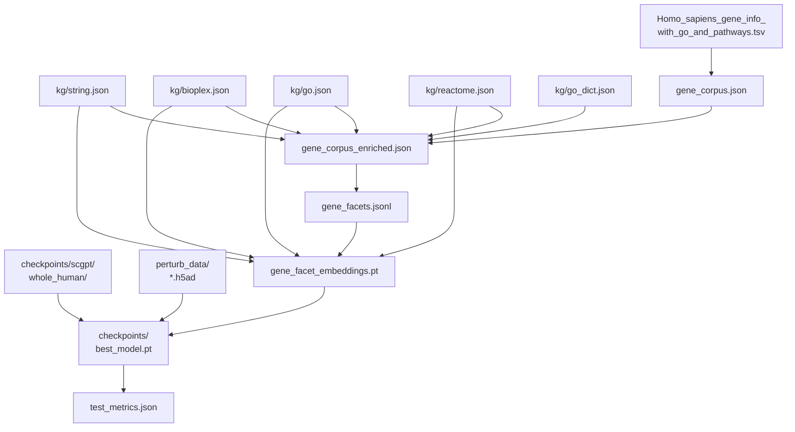

# DyGenePT Architecture Overview

## 1. Full System Pipeline

## 2. Precompute Pipeline Detail

```mermaid
flowchart LR
    subgraph Step1["Step 1"]
        A1[Gene Annotation TSV] -->|parse| A2[gene_corpus.json<br/>5000 genes text]
    end

    subgraph Step15["Step 1.5"]
        A2 --> B1{KG Sources}
        B1 -->|STRING PPI| B2[Interaction partners]
        B1 -->|BioPlex| B3[Co-complex partners]
        B1 -->|GO| B4[Co-annotated genes]
        B1 -->|Reactome| B5[Co-pathway genes]
        B2 & B3 & B4 & B5 --> B6[gene_corpus_enriched.json]
    end

    subgraph Step2["Step 2"]
        B6 -->|async 64 concurrent| C1[LLM API<br/>Gemini 3 Pro]
        C1 -->|8 facets per gene| C2[gene_facets.jsonl]
    end

    subgraph Step25["Step 2.5"]
        C2 -->|genes with NULL facets| D1[KG Neighbor Context]
        D1 -->|targeted LLM prompts| D2[Regenerated facets]
        D2 --> D3[gene_facets.jsonl<br/>updated]
    end

    subgraph Step3["Step 3"]
        D3 -->|text → embedding| E1[BiomedBERT /<br/>BioLORD-2023-M]
        E1 --> E2["gene_facet_embeddings.pt<br/>(G × 8 × 768)"]
    end

    subgraph Step4["Step 4"]
        E2 -->|NULL facets| F1[Multi-round KG<br/>Neighbor Propagation]
        F1 --> F2["Imputed Tensor<br/>+ Confidence Mask<br/>(native=1.0, imputed≤0.8)"]
    end
```

## 3. Model Architecture Detail

## 4. 8 Biological Facets

## 5. Training & Loss

## 6. Knowledge Graph Imputation (Step 4)

## 7. File Dependency Graph

