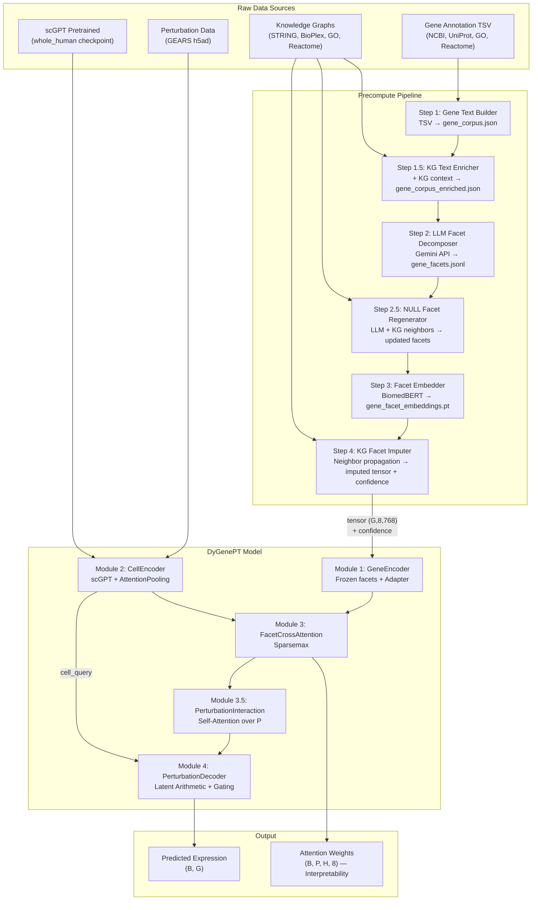
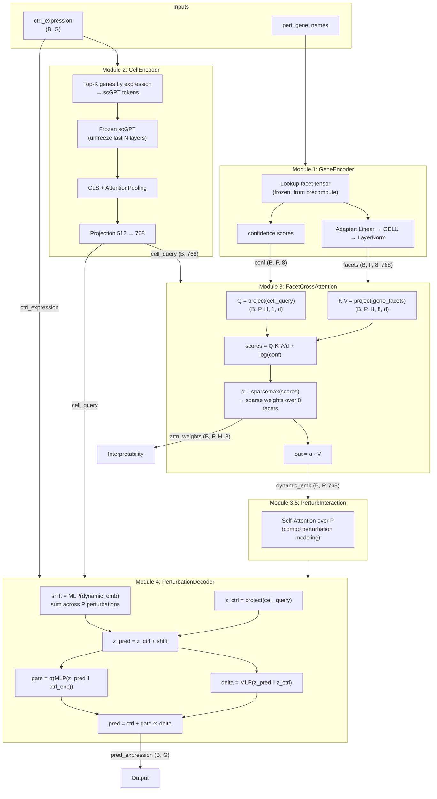
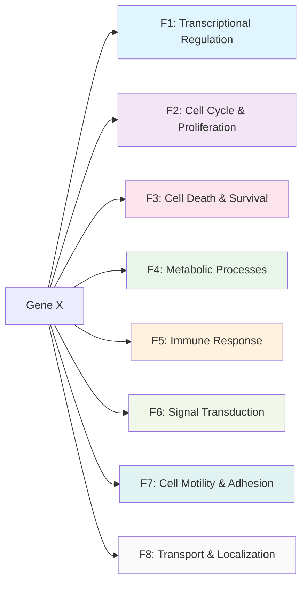
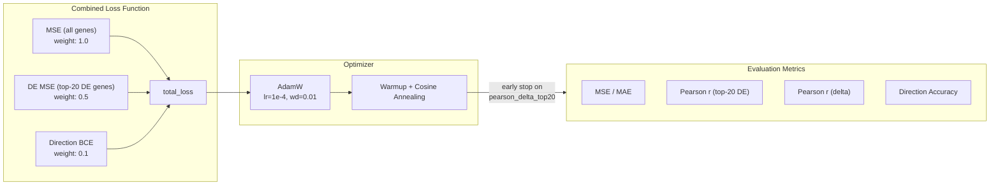
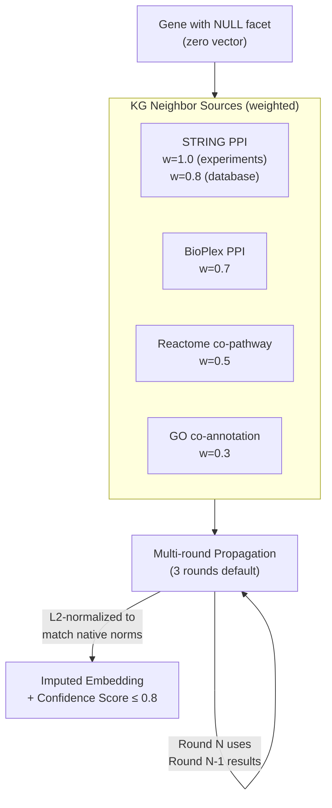
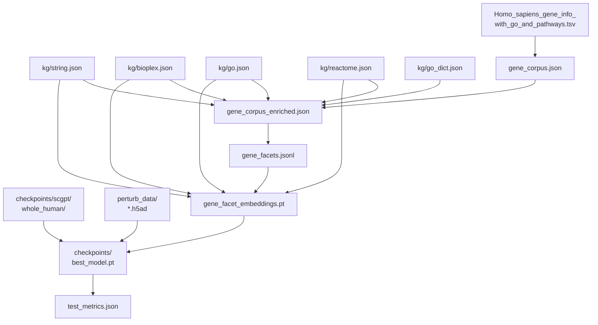

```mermaid
flowchart LR
    subgraph Step1["Step 1"]
        A1[Gene Annotation TSV] -->|parse| A2[gene_corpus.json<br/>5000 genes text]
    end

    subgraph Step15["Step 1.5"]
        A2 --> B1{KG Sources}
        B1 -->|STRING PPI| B2[Interaction partners]
        B1 -->|BioPlex| B3[Co-complex partners]
        B1 -->|GO| B4[Co-annotated genes]
        B1 -->|Reactome| B5[Co-pathway genes]
        B2 & B3 & B4 & B5 --> B6[gene_corpus_enriched.json]
    end

    subgraph Step2["Step 2"]
        B6 -->|async 64 concurrent| C1[LLM API<br/>Gemini 3 Pro]
        C1 -->|8 facets per gene| C2[gene_facets.jsonl]
    end

    subgraph Step25["Step 2.5"]
        C2 -->|genes with NULL facets| D1[KG Neighbor Context]
        D1 -->|targeted LLM prompts| D2[Regenerated facets]
        D2 --> D3[gene_facets.jsonl<br/>updated]
    end

    subgraph Step3["Step 3"]
        D3 -->|text → embedding| E1[BiomedBERT /<br/>BioLORD-2023-M]
        E1 --> E2["gene_facet_embeddings.pt<br/>(G × 8 × 768)"]
    end

    subgraph Step4["Step 4"]
        E2 -->|NULL facets| F1[Multi-round KG<br/>Neighbor Propagation]
        F1 --> F2["Imputed Tensor<br/>+ Confidence Mask<br/>(native=1.0, imputed≤0.8)"]
    end
```

# DyGenePT 系统架构总览

DyGenePT（Dynamic Gene Perturbation Transformer）是一个用于预测基因扰动后细胞转录组变化的深度学习框架。其核心思想是：同一个基因在不同细胞状态下可能发挥不同的功能（基因多效性），因此不应该用一个静态向量来表示基因。我们将每个基因通过 LLM 分解为 8 个生物学功能维度（facet），再由模型根据当前细胞状态动态选择相关维度，从而实现上下文感知的扰动预测。

## 1. 系统全局流程

系统分为三个阶段：**预计算**、**模型训练**、**推理评估**。预计算阶段将原始基因注释和知识图谱转化为固定的 facet 嵌入张量；模型阶段接收扰动数据和 facet 张量，通过 scGPT 编码细胞状态、Sparsemax 交叉注意力动态加权 facet、最终用潜空间算术预测表达谱变化。

## 2. 预计算流水线

预计算流水线共 6 步，目标是将每个基因转化为一个 `(8, 768)` 的 facet 嵌入矩阵。Step 1 从 NCBI/UniProt 注释构建基因文本；Step 1.5 用 STRING、BioPlex 等知识图谱补充交互上下文，对注释稀疏的基因尤为关键；Step 2 调用 LLM（Gemini 3 Pro）将文本分解为 8 个 facet 描述，无法识别的标记为 `<NULL>`；Step 2.5 针对 NULL facet，利用知识图谱邻居基因的已知 facet 构造定向 prompt，再次调用 LLM 尝试推断；Step 3 用 BiomedBERT 将文本编码为 768 维向量；Step 4 对仍然为空的 facet，通过多轮知识图谱邻居传播进行向量级填补，并标注置信度。

## 3. 模型架构

模型由四个模块串联组成。**GeneEncoder**（Module 1）从预计算的冻结张量中查表取出扰动基因的 8 个 facet 嵌入，经过可学习的 Adapter 层微调表征。**CellEncoder**（Module 2）将对照组表达谱输入预训练的 scGPT，选取表达量最高的基因作为 token 序列，通过 CLS + Attention Pooling 得到一个 768 维的细胞状态向量。**FacetCrossAttention**（Module 3）是核心创新：以细胞状态为 Query、8 个 facet 为 Key/Value，使用 Sparsemax 产生稀疏注意力权重，使模型在不同细胞上下文中只激活相关的功能维度，同时用 `log(confidence)` 偏置惩罚低置信度的填补 facet。对于组合扰动，Module 3.5 通过自注意力建模多个扰动基因之间的交互。**PerturbationDecoder**（Module 4）采用潜空间算术范式：将动态基因嵌入编码为 shift 向量，加到细胞潜表征上，再通过门控残差机制 `pred = ctrl + gate * delta` 输出最终预测。

## 4. 八维生物学 Facet

我们将基因功能分解为 8 个正交的生物学维度：转录调控、细胞周期与增殖、细胞死亡与存活、代谢过程、免疫应答、信号转导、细胞运动与黏附、转运与定位。这 8 个维度覆盖了细胞生物学的主要功能轴，由 LLM 根据基因注释文本为每个维度生成 2-4 句描述。Sparsemax 注意力机制会在推理时自动选择与当前细胞状态最相关的维度——例如在免疫细胞中，同一个激酶的"免疫应答"和"信号转导"维度可能被激活，而在上皮细胞中则可能切换到"细胞运动与黏附"维度。

## 5. 训练与损失函数

训练使用三项联合损失：全基因 MSE 保证整体表达谱的重建精度；Top-20 差异表达基因 MSE 聚焦于扰动效应最显著的基因，这也是领域内通用的评估重点；方向性 BCE 损失确保模型预测的上调/下调方向与真实值一致。优化器为 AdamW，配合 Warmup + Cosine Annealing 学习率调度。早停策略基于验证集的 `pearson_delta_top20` 指标。训练支持 DDP 多卡并行，以及 Replogle 数据集上的 5-fold 交叉验证。

## 6. 知识图谱 Facet 填补（Step 4）

经过 LLM 分解和二次推断后，仍有部分基因的某些 facet 为空（注释不足或 LLM 无法推断）。Step 4 利用蛋白质交互网络和功能注释图谱进行向量级填补：从 STRING PPI（实验验证权重最高）、BioPlex、Reactome 共通路、GO 共注释四个来源收集邻居基因的非空 facet 嵌入，按证据强度加权平均得到填补向量。采用多轮迭代传播（默认 3 轮），第 N 轮可以利用第 N-1 轮的填补结果。填补后的向量经 L2 归一化对齐到原生嵌入的模长，并标注置信度（原生=1.0，填补上限=0.8），供交叉注意力模块作为偏置使用。

## 7. 文件依赖关系

下图展示了整个系统中所有输入数据和中间产物之间的依赖关系。上游是原始的基因注释 TSV 和四套知识图谱 JSON，经过预计算流水线逐步产出 `gene_corpus.json` → `gene_corpus_enriched.json` → `gene_facets.jsonl` → `gene_facet_embeddings.pt`。训练阶段需要三个输入汇聚：预计算的 facet 嵌入张量、GEARS 格式的扰动数据（h5ad）、以及 scGPT 预训练权重。最终输出模型 checkpoint 和测试指标。

